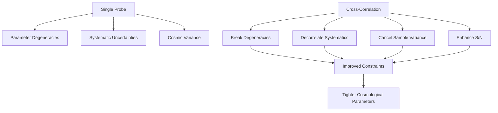

# Modified Gravity with Cross-Correlation

*Note: This project is ongoing and subject to continuous advancements and modifications.*

The project aims to **forecast the signatures of modified gravity theories** through cross-correlation analyses. It is a project of [Dunlap Institute](https://www.dunlap.utoronto.ca/) in collaboration with [CCDS](https://ccds.ai/) and [CASSA](https://cassa.site/).

---

## Overview

### Why Modified Gravity?

While the ΛCDM framework fits many observations, it relies on undetected dark energy and dark matter. Modified gravity theories offer an alternative explanation for cosmic acceleration and large-scale structure formation, without invoking unknown components. These theories modify the Poisson equation and gravitational potentials, creating observable signatures in the large-scale structure of the Universe, which can be tested through galaxy clustering and weak lensing.

### Why Cross-Correlation?

Cross-correlation techniques break degeneracies between cosmological parameters and reduce systematic errors by combining uncorrelated datasets.

#### Advantages of Cross-Correlation

| Advantage | Description |
|-----------|-------------|
| **Break degeneracies** | Between cosmological parameters |
| **Mitigate systematics** | Through uncorrelated noise cancellation |
| **Amplify signals** | Via joint analysis of multiple tracers |

---

## Modified Gravity Theories & Key Observables

### Modified Gravity Models

| Theory | Description | Key Parameters |
|--------|-------------|-----------------|
| **f(R) Gravity** | Replaces the Ricci scalar (R) in the Einstein-Hilbert action with a function (f(R)). Predicts scale-dependent growth rates and modified lensing potentials; scalar-tensor theories with modified Ricci scalar. | `f_R0`, scale-dependent growth |
| **DGP Gravity** | A braneworld scenario where gravity leaks into an extra dimension at large scales, leading to cosmic acceleration without a cosmological constant; extra-dimensional braneworld models. | `Ω_rc` (or `γ` growth index), self-accelerating branch |

### Key Observables

| Observable | Type | Notation | Description |
|------------|------|----------|-------------|
| **Galaxy–Galaxy Clustering** | Auto-correlation | $C_\ell^{gg}$ (GG) | Measures galaxy clustering |
| **Galaxy–CMB Lensing Cross-Correlation** | Cross-correlation | $C_\ell^{\kappa g}$ (GCMB) | Measures galaxy-lensing correlation |

These observables provide insights into structure growth and gravitational lensing effects, crucial for probing modified gravity.

---

## Project Description & Goals

This project calculates and analyzes **galaxy–galaxy power spectra** ($C_\ell^{gg}$) and **galaxy–CMB lensing cross-power spectra** ($C_\ell^{\kappa g}$) using theoretical models including **nDGP**, **e-mantis**, and **Bacco** emulators.

### Forecasting Capability

The project forecasts the ability of future cosmological surveys to constrain modified gravity theories. Using mock observations and theoretical predictions, the framework evaluates how well upcoming data can differentiate between General Relativity and alternative gravity models.

#### Forecasting Pipeline

| Component | Description |
|-----------|-------------|
| **Synthetic Observables** | Theoretical power spectra from MG models using **nDGP**, **e-mantis**, and **Bacco** |
| **Survey Modeling** | Incorporation of survey characteristics (e.g., sky coverage, galaxy density) from LSST/DESC and Simons Observatory (to be added) |
| **Fisher Matrix Analysis** | Quantifies the precision of cosmological and MG parameter constraints |
| **Bias and Degeneracy Evaluation** | Assesses degeneracies between MG and ΛCDM parameters |

This pipeline provides a **forecasting tool for MG detectability** by assessing how specific MG models affect cross-correlation observables.

---

## Methodology

### Theoretical Framework & Cross-Correlation Techniques

The project uses a **multi-tracer approach**, combining data from different sources to enhance signal-to-noise and reduce systematics through power spectra analysis of galaxy–galaxy auto-correlation and galaxy–CMB lensing cross-correlation.

### Forecasting and Statistical Analysis

| Method | Purpose |
|--------|---------|
| **Fisher Matrix Forecasting** | Quantifies parameter constraints and breaks degeneracies between cosmological parameters |
| **Emulator-Based Acceleration** | Uses **nDGP**, **e-mantis**, and **Bacco** for rapid computation of power spectra across parameter grids |

### Choice of Emulators

Multiple emulators were explored, including **nDGP**, **e-mantis**, **Bacco**, **MGemu**, **fRemu**, and **Cosmopower**. Ultimately, **nDGP**, **e-mantis**, and **Bacco** were selected based on performance, model coverage, and suitability for the analysis.

## Nonlinear Parameter Comparison: Bacco, e-MANTIS, and nDGP (using $\sigma_8$)

| Parameter | Bacco (Nonlinear ΛCDM P(k)) | e-MANTIS (f(R) P(k)) | nDGP (DGP P(k)) |
|-----------|------------------------|----------------------|-----------------|
| **Cold matter density** $\Omega_{cb}$ | 0.23–0.40 | 0.155–0.465 | 0.28–0.36 |
| **Baryon density** $\Omega_b$ | 0.04–0.06 | 0.037–0.062 | 0.04–0.06 |
| **$\sigma_8$ / Power spectrum** | 0.73–0.90 | 0.608–1.014 | $A_s$: 1.7–2.5×10⁻⁹ |
| **Spectral index** $n_s$ | 0.92–1.01 | 0.72–1.20 | 0.92–1.00 |
| **Hubble parameter** $h$ | 0.60–0.80 | 0.55–0.85 | 0.61–0.73 |
| **Neutrino mass** $\Sigma m_\nu$ | 0.0–0.4 eV | — | — |
| **Dark Energy** $w_0$ | −1.15 to −0.85 | — | — |
| **Dark Energy** $w_a$ | −0.30 to +0.30 | — | — |
| **Modified Gravity param.** | None (ΛCDM) | $\|f_{R_0}\|$: 10⁻⁷–10⁻⁴ | $H_0 r_c$: 0.2–20 |
| **Scale factor** $a$ (z-range) | 0.4–1.0 (z: 0–1.5) | 0.25–1.0 (z: 0–3) | No explicit $a$ param. |
| **k-range** $[h \text{ Mpc}^{-1}]$ | $[10^{-2}, 5]$ | $[0.03, 10]$ | $[0.01, 5]$ |
| **Redshift range** | 0–1.5 | 0–3 | 0–2 |
| **Accuracy** | ~1% | ~1–3% | ~2–3% |
| **Primary Output** | Full $P(k)$ [ΛCDM] | Boost factor $B(k)$ | Boost factor $B(k)$ |

### Key Differences:

**Bacco** provides the most extensive cosmological parameter space, including neutrino masses and dynamical dark energy, but only for ΛCDM gravity. It outputs the full nonlinear power spectrum.

**e-MANTIS** specializes in f(R) gravity with a more limited cosmological parameter range but covers wider redshifts (z: 0–3) and wavenumbers. It outputs a boost factor relative to ΛCDM.

**nDGP** provides predictions for nDGP gravity with the tightest parameter constraints but extends to lower wavenumbers (k = 0.01). Like e-MANTIS, it returns a boost factor for the modified gravity signature.

## Nonlinear Parameter Comparison: Bacco, e-MANTIS, and nDGP (Using $A_s$)

| Parameter | Bacco (Nonlinear ΛCDM P(k)) | e-MANTIS (f(R) P(k)) | nDGP (DGP P(k)) |
|-----------|------------------------|----------------------|-----------------|
| **Cold matter density** $\Omega_{cb}$ | 0.23–0.40 | 0.155–0.465 | 0.28–0.36 |
| **Baryon density** $\Omega_b$ | 0.04–0.06 | 0.037–0.062 | 0.04–0.06 |
| **Primordial amplitude** $A_s$ | ~1.7×10⁻⁹ (tuned from $\sigma_8$) | ~1.5–2.0×10⁻⁹ (internal) | 1.7–2.5×10⁻⁹ |
| **Spectral index** $n_s$ | 0.92–1.01 | 0.72–1.20 | 0.92–1.00 |
| **Hubble parameter** $h$ | 0.60–0.80 | 0.55–0.85 | 0.61–0.73 |
| **Neutrino mass** $\Sigma m_\nu$ | 0.0–0.4 eV | — | — |
| **Dark Energy** $w_0$ | −1.15 to −0.85 | — | — |
| **Dark Energy** $w_a$ | −0.30 to +0.30 | — | — |
| **Modified Gravity param.** | None (ΛCDM) | $\|f_{R_0}\|$: 10⁻⁷–10⁻⁴ | $H_0 r_c$: 0.2–20 |
| **Scale factor** $a$ (z-range) | 0.4–1.0 (z: 0–1.5) | 0.25–1.0 (z: 0–3) | No explicit $a$ param. |
| **k-range** $[h \text{ Mpc}^{-1}]$ | $[10^{-2}, 5]$ | $[0.03, 10]$ | $[0.01, 5]$ |
| **Redshift range** | 0–1.5 | 0–3 | 0–2 |
| **Accuracy** | ~1% | ~1–3% | ~2–3% |
| **Primary Output** | Full $P(k)$ [ΛCDM] | Boost factor $B(k)$ | Boost factor $B(k)$ |

### Key Notes on $A_s$:

* **Bacco**: Uses $\sigma_8$ internally but can be converted to $A_s$ through ΛCDM linear theory. Typical value ~1.7×10⁻⁹ at k = 0.05 Mpc⁻¹.
* **e-MANTIS**: Uses internal normalization with $A_s$ implicitly handled through $\sigma_8$ mapping. The f(R) boost factor is computed relative to ΛCDM predictions.
* **nDGP**: Explicitly uses $A_s \in [1.7–2.5] \times 10^{-9}$ as a direct input parameter in the nonlinear regime.

## Parameters we are using

| Parameter | Bacco (Nonlinear ΛCDM P(k)) | e-MANTIS (f(R) P(k)) | nDGP (DGP P(k)) |
|-----------|------------------------------|-----------------------------|------------------------|
| **Cold matter density** $\Omega_{cb}$ | 0.23 – 0.40 | 0.155 – 0.465 | 0.28 – 0.36 |
| **Primordial amplitude** $A_s$ | $\sim 1.7 \times 10^{-9}$ (tuned from $\sigma_8$) | $\sim (1.5–2.0) \times 10^{-9}$ (internal) | $(1.7–2.5)\times 10^{-9}$ |
| **Hubble parameter** $h$ | 0.60 – 0.80 | 0.55 – 0.85 | 0.61 – 0.73 |
| **Bias** $b_0$ | — | — | — |
| **Modified Gravity param.** $\lvert f_{R0} \rvert$ | None (ΛCDM) | $10^{-7} – 10^{-4}$ | — |
| **Modified Gravity param.** $H_0 r_c$ | None (ΛCDM) | — | 0.2 – 20 |

### Interpretation and Visualization

| Analysis Type | Description |
|---------------|-------------|
| **Parameter Sensitivity** | Assess the impact of MG parameters on observables |
| **Survey Specifications** | Simulate realistic measurements with survey details |
| **Bias Evaluation** | Identify biases and systematics in parameter estimation due to MG effects |

---

## References

#### *Emulators • HEALPix/healpy • Angular Power Spectra* 

| **Emulator** | **Links** | **HEALPix / healpy** | **Links** | **Angular Power Spectra** | **Links** |
|--------------|-----------|-----------------------|-----------|----------------------------|-----------|
| **nDGP** | [Fiorini 2023](https://arxiv.org/pdf/2310.05786) • [Docs](https://github.com/BartolomeoF/nDGPemu) | **healpy GitHub** | [healpy](https://github.com/healpy/healpy) | **NaMaster** | [GitHub](https://github.com/LSSTDESC/NaMaster) • [Docs](https://namaster.readthedocs.io/en/latest/) |
| **e-mantis** | [Sáez-Casares 2023](https://arxiv.org/pdf/2303.08899) • [Docs](https://e-mantis.pages.obspm.fr/e-mantis/main/index.html) | **healpy Docs** | [readthedocs](https://healpy.readthedocs.io/en/latest/) | **NaMaster Covariances** | [Covariances](https://namaster.readthedocs.io/en/latest/3Covariances.html) |
| **Bacco** | [Aricò 2020](https://arxiv.org/pdf/2011.15018) • [Docs](https://baccoemu.readthedocs.io/) | **Tutorial** | [healpy-sims.ipynb](https://github.com/tanveerkarim/myTutorials/blob/main/notebooks/healpy-sims.ipynb) | **CCL** | [Docs](https://ccl.readthedocs.io/en/latest/) |

#### *Statistical Tools • LSSTDESC Tutorials* 

| **Statistical / Sampling Tool** | **Docs** | **LSSTDESC Tutorial** | **Notebook** |
|----------------------------------|----------|------------------------|--------------|
| **emcee** | [Docs](https://emcee.readthedocs.io/en/stable/) | **C_ℓ in pyccl** | [CellsCorrelations.ipynb](https://github.com/LSSTDESC/CCLX/blob/master/CellsCorrelations.ipynb) |
| **pocoMC** | [Docs](https://pocomc.readthedocs.io/en/latest/) | **Emulators (Bacco)** | [Cosmological_Emulator.ipynb](https://github.com/LSSTDESC/CCLX/blob/master/Cosmological_Emulator.ipynb) |
| **Corner** | [Docs](https://corner.readthedocs.io/en/latest/) | **Tomographic bins** | [Redshift_Distributions.ipynb](https://github.com/LSSTDESC/CCLX/blob/master/LSST_SRD_Redshift_Distributions_and_Binning.ipynb) |
| **GetDist** | [Docs](https://getdist.readthedocs.io/en/latest/) | **emcee + pyccl** | [MCMC Likelihood Analysis.ipynb](https://github.com/LSSTDESC/CCLX/blob/master/MCMC%20Likelihood%20Analysis.ipynb) |

#### *Astropy Cosmology*

| Category | Resource | Link |
|----------|----------|------|
| **General** | Overview | [docs.astropy.org/cosmology](https://docs.astropy.org/en/stable/cosmology/index.html) |
| | Base API | [astropy.cosmology.Cosmology](https://docs.astropy.org/en/latest/api/astropy.cosmology.Cosmology.html) |
| | Units | [cosmology/units](https://docs.astropy.org/en/latest/cosmology/units.html) |
| **Models** | LambdaCDM | [astropy.cosmology.LambdaCDM](https://docs.astropy.org/en/stable/api/astropy.cosmology.LambdaCDM.html) |
| | FlatLambdaCDM | [astropy.cosmology.FlatLambdaCDM](https://docs.astropy.org/en/stable/api/astropy.cosmology.FlatLambdaCDM.html) |
| | FlatwCDM | [astropy.cosmology.FlatwCDM](https://docs.astropy.org/en/stable/api/astropy.cosmology.FlatwCDM.html) |
| | FLRW | [astropy.cosmology.FLRW](https://docs.astropy.org/en/stable/api/astropy.cosmology.FLRW.html) |
| **Utilities** | Planck18 | [astropy.cosmology.realizations.Planck18](https://docs.astropy.org/en/latest/api/astropy.cosmology.realizations.Planck18.html) |
| | Redshift-Distance Units | [cosmology.units.redshift_distance](https://docs.astropy.org/en/stable/api/astropy.cosmology.units.redshift_distance.html) |

*More references can be found in the extended reference list: [here](https://github.com/Adrita-Khan/Modified-Gravity/blob/main/references.md)*

---

## Contact

**Adrita Khan**  
[Email](mailto:adrita.khan.official@gmail.com) | [LinkedIn](https://www.linkedin.com/in/adrita-khan) | [Twitter](https://x.com/Adrita_)

---

*This repository offers a comprehensive resource for understanding, testing, and contributing to the Modified Gravity project. It includes theoretical models and tools for computing cross-correlated power spectra, focusing on testing theories like f(R) and DGP using advanced computational methods and survey simulations.*
